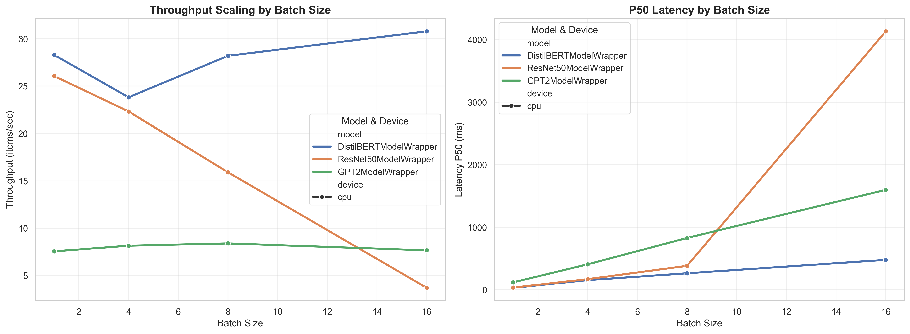

# Week 1: CPU Inference Baseline Analysis

**Analysis Period:** December 22-28, 2025  
**Platform:** macOS (Apple Silicon) | PyTorch 2.1.0 | CPU-only execution

---

## Executive Summary

This week established CPU baseline performance for three production models: **ResNet50** (25.6M params), **GPT-2** (124M params), and **DistilBERT** (66M params).

> **KEY FINDING:** Python interpreter overhead accounts for **61-80%** of total execution time across all models, representing the primary optimization target.

**Performance Highlights:**
- **Best Throughput:** DistilBERT at 30.79 items/s (batch size 16)
- **Lowest Latency:** ResNet50 at 36.89ms P50 (batch size 1)  
- **Critical Issue:** ResNet50 exhibits 85.8% throughput collapse at batch size 16

---

## 1. Experimental Setup

We tested three models representing different computational patterns across batch sizes 1, 4, 8, and 16 with 20 warmup iterations followed by 100 measurement iterations. All inputs were synthetic random data matching expected dimensions (224×224×3 for ResNet50, 128 tokens for transformers).

**Profiling Tools:** PyTorch Profiler (operator timing), Layer Timer (module breakdown), Memory Tracker (allocation monitoring), and Python Overhead Analyzer (function-level profiling).

---

## 2. Performance Results

*Figure 1: Latency and throughput measurements across batch sizes*

### 2.1 DistilBERT Results

| Batch Size | P50 Latency | P99 Latency | Throughput | Memory  |
|-----------:|------------:|------------:|-----------:|--------:|
| 1          | 33.61 ms    | 52.76 ms    | 28.30 i/s  | 245 MB  |
| 4          | 155.72 ms   | 434.83 ms   | 23.82 i/s  | 266 MB  |
| 8          | 265.42 ms   | 514.31 ms   | 28.20 i/s  | 291 MB  |
| 16         | 480.20 ms   | 1087.80 ms  | 30.79 i/s  | 359 MB  |

### 2.2 GPT-2 Results

| Batch Size | P50 Latency | P99 Latency | Throughput | Memory  | CPU Util |
|-----------:|------------:|------------:|-----------:|--------:|---------:|
| 1          | 120.63 ms   | 339.41 ms   | 7.55 i/s   | 549 MB  | 132.7%   |
| 4          | 408.96 ms   | 1952.37 ms  | 8.15 i/s   | 718 MB  | 141.0%   |
| 8          | 830.68 ms   | 2948.34 ms  | 8.39 i/s   | 633 MB  | 145.3%   |
| 16         | 1599.74 ms  | 6513.32 ms  | 7.66 i/s   | 542 MB  | 128.2%   |

### 2.3 ResNet50 Results

| Batch Size | P50 Latency | P99 Latency | Throughput | Memory  | CPU Util |
|-----------:|------------:|------------:|-----------:|--------:|---------:|
| 1          | 36.89 ms    | 49.83 ms    | 26.07 i/s  | 265 MB  | 166.2%   |
| 4          | 171.91 ms   | 326.41 ms   | 22.32 i/s  | 352 MB  | 276.0%   |
| 8          | 384.51 ms   | 1519.48 ms  | 15.90 i/s  | 363 MB  | 215.0%   |
| 16         | 4133.63 ms  | 6585.89 ms  | 3.70 i/s   | 469 MB  | 325.7%   |

> **Critical Issue:** ResNet50 throughput collapses at batch size 16 (85.8% drop from BS=1)

### 2.4 Overall Performance Summary

| Model      | Params | Best Throughput   | Best Latency (P50) | Peak Memory | Python Overhead | Bottleneck Operator      |
|------------|-------:|------------------:|-------------------:|------------:|----------------:|--------------------------|
| DistilBERT | 66M    | 30.79 i/s (BS=16) | 33.61 ms (BS=1)    | 358.9 MB    | 64.15%          | Matrix Multiply (69.35%) |
| GPT-2      | 124M   | 8.39 i/s (BS=8)   | 120.63 ms (BS=1)   | 717.7 MB    | 61.24%          | Matrix Multiply (74.85%) |
| ResNet50   | 25.6M  | 26.07 i/s (BS=1)  | 36.89 ms (BS=1)    | 468.6 MB    | 79.80%          | Convolution (67.07%)     |

---

## 3. Key Findings

### 3.1 Python Overhead Dominates All Models

> **Finding:** Python interpreter overhead accounts for 61-80% of total execution time across all models.

ResNet50 is particularly affected at **79.80%**, meaning only 20% of time is spent in actual tensor operations. This occurs because each forward pass triggers hundreds of Python function calls (`__call__` → `_wrapped_call_impl` → `_call_impl` → `forward`) before reaching C++ kernels.

**Optimization Potential:** 3-5× speedup achievable through compilation techniques.

### 3.2 Transformer Models: Matrix Multiplication Bottleneck

Both DistilBERT and GPT-2 spend **69-75%** of their compute time in matrix multiplication operations (`aten::addmm` and `aten::mm`).

| Metric | DistilBERT | GPT-2 | Analysis |
|--------|------------|-------|----------|
| **Compute** | 1.74 TFLOPs | 5.06 TFLOPs | 2.9× increase due to model size |
| **MatMul Dominance** | 69.35% | 74.85% | Primary bottleneck for both |
| **Layer Distribution** | 70% transformer, 30% embeddings | 72% transformer, 28% LM head | Consistent patterns |

**Optimization Target:** Matrix operations are ideal candidates for INT8 quantization (expected 3-4× speedup).

### 3.3 ResNet50: Unoptimized Convolution Backend

> **Critical Issue:** ResNet50 uses `_slow_conv2d_forward`, indicating missing Intel MKL-DNN optimizations.

**Performance Degradation:**
- Batch size 1: 26.07 items/s  
- Batch size 16: 3.70 items/s  
- **Impact:** 85.8% throughput loss

**Root Cause:** Convolution operations consume 67.07% of compute time using unoptimized fallback implementation. Likely causes include cache thrashing or memory bandwidth saturation at higher batch sizes.

**Immediate Action:** Enable MKL-DNN for estimated 2-3× speedup.

### 3.4 Memory Efficiency Analysis

| Model | Peak Memory | Bytes/Param | Efficiency |
|-------|------------:|------------:|-----------|
| ResNet50 | 468.6 MB | 18.3 | Excellent (residual connections) |
| DistilBERT | 358.9 MB | 5.4 | Moderate (attention overhead) |
| GPT-2 | 717.7 MB | 5.8 | Poor (2× DistilBERT params, 2× memory) |

---

## 4. Conclusions and Optimization Roadmap

### What We Learned

This baseline characterization reveals three major optimization targets:

1. **Python overhead is the primary bottleneck** (61-80% of time) — represents 3-5× speedup potential
2. **Model-specific compute patterns** are clear: transformers bottlenecked by matrix multiplication, ResNet50 by unoptimized convolution
3. **Batch processing behavior** differs dramatically: DistilBERT scales well (+8.8%), GPT-2 plateaus (+11.1%), ResNet50 fails (-85.8%)

### Week 2 Priorities

**Priority 1: Enable Missing Optimizations**
1. Enable Intel MKL-DNN for ResNet50 convolutions
2. Test TorchScript compilation (`torch.jit.trace()`)

**Priority 2: Quantization Experiments**
- INT8 dynamic quantization on transformers (expected 3-4× speedup)
- Measure accuracy vs performance tradeoffs

**Priority 3: GPU Baseline**
- Run identical experiments on CUDA
- Compare CPU vs GPU performance
- Test FP16 mixed precision

### Estimated Optimization Potential

| Technique | Expected Speedup | Effort | Target Models |
|-----------|------------------|--------|---------------|
| **INT8 Quantization** | 3-4× | Medium | Transformers |
| **TorchScript** | 2-3× | Low | All models |
| **MKL-DNN** | 2-3× | Low | ResNet50 |
| **Operator Fusion** | 1.5-2× | High | All models |

> **Combined Potential:** 6-12× speedup achievable through quantization + compilation

---

**Date:** December 28, 2025  
**Status:** Baseline Complete | Optimization Phase Ready

